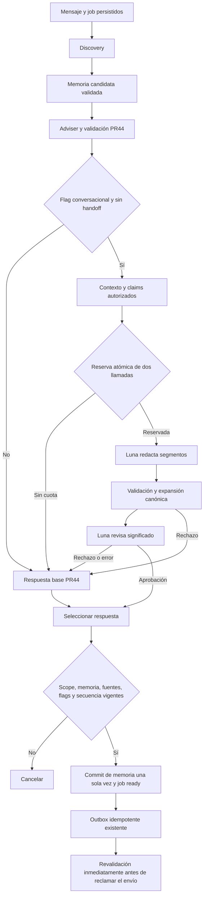

# Luri Conversational Response Layer

Incremento independiente sobre PR #44. Apagado por defecto. No se habilitó ningún tenant, no se hicieron llamadas pagadas y no se desplegó esta versión durante su preparación.

## Comportamiento

Luri valida las necesidades y recomendaciones como en PR #44. Conserva la respuesta base y construye un contexto mínimo de claims. Luna propone segmentos naturales; Luri verifica sus referencias, inserta valores y cláusulas canónicos y solicita a Luna una revisión independiente. Solo una propuesta íntegramente aprobada puede llegar al outbox existente.



No se añaden acciones comerciales. Ofrecer atención humana en texto no crea un handoff; las solicitudes de handoff detectadas por discovery/adviser conservan el recorrido de PR #44 y omiten esta capa.

## Contratos finales

Definidos en `app/domain/generative_ai/response_contracts.py`, con modelos estrictos, campos extra prohibidos y colecciones acotadas:

- `ValidatedResponseContext`: necesidades con evidencia, hechos publicados, claims, relaciones verificadas, comparaciones autorizadas, incertidumbres, preguntas pendientes, siguientes pasos, productos, valores/cláusulas canónicos y estilo interno versionado.
- `AuthorizedClaim`: sujetos, predicado permitido, hechos/necesidades asociados, valores permitidos, cláusulas obligatorias y política de expresión. No equivale a citar una fuente arbitrariamente.
- `ConversationalDraft`: context_id y 1–8 segmentos; cada segmento tiene tipo, texto de hasta 700 caracteres, referencias a claims/necesidades y referencias opcionales a pregunta, siguiente paso e incertidumbre.
- `SemanticReview`: context_id, digest del texto expandido, aprobación global y un resultado por cada segmento, con código normalizado y referencias problemáticas. No admite texto corregido ni acciones.

La identidad tenant/bot/conversación/configuración pertenece al envelope durable interno: job, hash base, revisión de memoria, secuencia, fuentes y checkpoint. El proveedor recibe una proyección de contenido autorizado, nunca autoridad para fijar esos identificadores. El checkpoint guarda un UUID estable de contexto, versión de esquema y digest de la respuesta seleccionada.

Ejemplo sintético completo: [`examples/luri_response_context.synthetic.json`](examples/luri_response_context.synthetic.json). Ejemplo de claim de ajuste:

```json
{
  "id": "claim_product_0_age",
  "subject_refs": ["product_0"],
  "predicate": "need_matches_attribute",
  "fact_refs": ["product_0_age"],
  "need_refs": ["need_age"],
  "allowed_value_refs": ["product_0_age"],
  "required_clause_refs": ["product_0_age"],
  "expression_policy": "canonical_clause"
}
```

Autoriza explicar un ajuste ya comprobado. No autoriza afirmar que el producto es seguro, mejor, educativo o está disponible si esas propiedades no constan como hechos autorizados.

## Valores, cláusulas y comparaciones

Los únicos placeholders son `{{product:ID}}`, `{{value:ID}}` y `{{clause:ID}}`. Se resuelven en una pasada, sin evaluar código ni interpretar recursivamente el resultado. Un ID desconocido, sin permiso en el segmento, duplicado, vacío o una plantilla mal formada rechaza el borrador.

Una cláusula ocupa un segmento completo. No puede llevar un prefijo que la niegue ni un sufijo que altere su condición. La revisión examina además contradicciones desde otros segmentos. El texto expandido debe caber íntegro en `min(3500, límite de WhatsApp)`; la capa nueva no recorta una cláusula aprobada.

El catálogo actual no tipa de forma fiable dinero, moneda, vigencia, stock ni sensibilidad contractual. Por eso todos los atributos recomendados y las citas de conocimiento se preservan inicialmente como cláusulas completas. Esta política protege precios, edades, rangos, porcentajes, unidades, cantidades, fechas y condiciones cuando están en esas cláusulas. Los valores de necesidades pueden insertarse por referencia sin convertirse en hechos del negocio.

Hay una comparación inicial demostrable: dos productos tienen exactamente el mismo atributo publicado, incluidos sus límites numéricos. No se infiere «más barato», superioridad ni relación calidad/precio desde texto libre. Una comparación monetaria necesita un contrato futuro de dinero y vigencia: no se considera implementado por esta capa.

La prosa de reconocimiento, transiciones y explicación de correspondencias puede variar. Los controles léxicos no demuestran semántica; la revisión de Luna es una defensa adicional y falible. El piloto y la evaluación posterior deben medir su calidad real.

## Lease y reinicios

Regla por claim: `etapas_habilitadas × (timeout_configurado + 15 segundos) + 30 segundos`. Las etapas habilitadas son discovery/adviser y, cuando corresponde, redacción/revisión. Cada etapa puede realizar como máximo una llamada en ese claim. Los 15 segundos por etapa cubren procesamiento y persistencia; los 30 segundos finales cubren coordinación/cierre.

Con timeout 20: modo base 100 segundos; modo conversacional 170. Con timeout 60: modo conversacional 330. No hay reintentos ocultos dentro del proveedor. Reintentar una fase base requiere otro claim y respeta `BOTWA_AI_MAX_ATTEMPTS` y la edad máxima del job. Un lease finito vencido es recuperable por el mecanismo IA existente; no reactiva la recuperación general de WhatsApp.

Checkpoint cifrado por job desde el snapshot inicial. Se guardan resultados de discovery, fuentes recuperadas tras aplicar memoria candidata, adviser, redacción y revisión. Al recuperar se reutilizan resultados persistidos, comprobando su vigencia. La memoria se actualiza en base de datos una sola vez al dejar `ready`; su aplicación anterior es sobre una copia candidata.

Una caída entre una llamada remota y su persistencia es ambigua: **no se promete exactly-once para OpenAI**. En discovery/adviser puede repetirse una llamada dentro de los límites base. En las dos fases nuevas se elige la respuesta base ante un resultado desconocido, sin repetir automáticamente la llamada ni crear bucles de reparación. Los efectos internos conservan receipt/job/outbound únicos y fencing por token.

Un reinicio después de crear outbox retoma ese mismo mensaje. Los estados de entrega desconocida conservan el tratamiento de PR #44; no disparan reenvíos ciegos.

## Presupuesto y reservas

Antes de la redacción se reservan **dos slots** en `ai_attempt` mediante el mismo bloqueo asesor PostgreSQL de admisión, bloqueo del job/bot y una transacción corta. Si no caben ambos, no se llama al redactor y se usa la base segura.

`reserved` consume cuota pero no se cuenta como llamada realizada ni como consumo de tokens. Al iniciar la etapa pasa a `unknown`; al terminar se registra el resultado y uso real. Un slot no utilizado pasa a `released` y deja de consumir cuota. Reservar dos veces el mismo job reutiliza los slots existentes. Las reservas pendientes siguen contabilizadas al cruzar medianoche hasta que se consumen o liberan; no pueden desaparecer por un cambio de día.

Se conservan ambos límites:

- Global: `BOTWA_AI_DAILY_CALL_LIMIT`.
- Por tenant/bot: `2 × generative_ai.daily_jobs`, la capacidad histórica de llamadas de PR #44.

No se duplica el límite al activar naturalidad. Con `daily_jobs=25` siguen existiendo 50 slots, compartidos entre las cuatro etapas y reintentos. Un turno normal conversacional usa hasta cuatro llamadas; no garantiza 25 turnos completos. No se cambia la semántica de la configuración ni se requieren variables nuevas.

## Persistencia y privacidad

Migración `20260921_0026`, sobre `20260920_0025`:

- Nueva `ai_response_checkpoint`, PK/FK por job, context_id único, revisión de esquema/memoria, etapa, decisión, motivo, digest y última etapa de reanudación.
- Contenido transitorio cifrado con el mecanismo existente.
- `ai_attempt.stage` aumenta de 20 a 32 caracteres.

Mientras se procesan las fases base se necesita el snapshot cifrado para reanudar correctamente. Al dejar `ready`, se eliminan del checkpoint historial y catálogo bruto, conservando la base, contexto autorizado y salidas normalizadas nuevas. Tras estado terminal, el siguiente ciclo del carril IA limpia el payload y libera reservas; si el worker está detenido, la limpieza espera a su reanudación. No se crea un servicio adicional ni se imprimen contenidos privados en logs.

Upgrade en un entorno autorizado: `python -m alembic upgrade head`.

Downgrade: primero apagar la capa y resolver sus jobs. `python -m alembic downgrade 20260920_0025` rechaza la operación si quedan jobs conversacionales activos. Elimina checkpoints, pero mantiene el ancho de 32 en `ai_attempt.stage` para no truncar auditoría histórica. La aplicación anterior tolera ese ancho; no es una reversión física exacta del tipo.

## Activación únicamente del piloto

No ejecutada durante esta implementación. Requiere desplegar/migrar cuando se autorice y conservar la configuración segura de OpenAI descrita en [LURI_IA_OPERACION.md](LURI_IA_OPERACION.md): clave solo en el almacén de secretos del worker, nunca en settings, comandos con valores literales, repositorio o logs.

1. Mantener `BOTWA_AI_PILOT_SCOPES` limitado al par tenant/bot elegido; conservar flags globales y condiciones de PR #44.
2. Obtener `GET /bots/{bot_id}` con usuario autorizado del tenant. Copiar todos los settings actuales.
3. Conservar `generative_ai.enabled=true`, necesidades y presupuesto; añadir únicamente `generative_ai.conversational_response={"enabled":true}`.
4. Enviar `PATCH /bots/{bot_id}` con `{"settings": <objeto completo fusionado>}`. Este endpoint reemplaza settings; no enviar un fragmento que borre configuración existente.
5. Mantener la nueva flag ausente o false en todos los demás bots.
6. Solo tras autorización de llamadas reales, realizar un smoke pequeño y observar etapas, fallbacks, cuota, cola y retrasos de automatización.

## Apagado y rollback

Poner solo `generative_ai.conversational_response.enabled=false` mediante el mismo GET/fusión/PATCH. Discovery, memoria, recomendaciones, handoff y métricas base permanecen activas. La ausencia del campo equivale a false y conserva los hashes base históricos.

Un cambio exclusivamente de esta configuración revoca la propuesta conversacional en curso incluso si posteriormente se reactiva. Antes de outbox puede seleccionarse la base si su contexto sigue vigente. Si el outbox ya existe y aún no fue enviado, se cancela la propuesta revocada; no se crea otro mensaje para esa entrada. Una petición ya en vuelo no puede retirarse.

Cambios en configuración base, nueva entrada, memoria, fuente, scope o handoff invalidan el contexto: se cancela y no se envía tampoco una base obsoleta. Se revalida al finalizar, al crear outbox y al reclamar su envío.

Para rollback de binario a PR #44: apagar la capa, drenar/resolver jobs y quitar el objeto `conversational_response` de settings conservando todo lo demás. PR #44 usa un contrato estricto que no conoce ese campo. Mantener inicialmente la migración aditiva; no es necesario borrar datos para desactivar la capacidad. No ejecutar rollback con llamadas en vuelo.

## Métricas y verificación

`python -m app.operations.ai_metrics` mantiene métricas base y añade `stages` para discovery, adviser, conversational_render y semantic_review, con llamadas, tokens conocidos, uso desconocido, latencia y errores. Añade reservas pendientes, jobs de la capa, decisiones aprobadas/fallback, códigos y checkpoint de reanudación. El tiempo mensaje→envío se conserva.

Las decisiones cuentan selección, no necesariamente entrega: un job aprobado puede cancelarse después por contexto obsoleto. Las razones `REVIEW_*` identifican rechazos semánticos. Calcular tasas usando el mismo intervalo/muestra y declarar el denominador; la muestra está acotada. El coste adicional requiere aplicar la tarifa vigente al uso registrado, no asumir que una llamada o un token tiene coste fijo.

Pruebas nuevas: contratos y placeholders; cláusulas; revisión estricta; reserva previa; timeout/resultado ambiguo; cuatro llamadas largas dentro del lease; recuperación después de cada etapa y alrededor de outbox; memoria única; aislamiento; handoff concurrente; vigencia y regresión de salida exacta con flag apagada. Proveedores y transporte externos son falsos. El gate PostgreSQL incorpora estos recorridos con locks/transacciones reales.

Pendiente deliberadamente: evaluación A/B de 30–50 conversaciones, llamadas reales, medición de naturalidad/coste reales, activación piloto, despliegue y merge. No se incorporan nuevos modelos, herramientas, pagos, reservas, infraestructura ni autonomía comercial.
